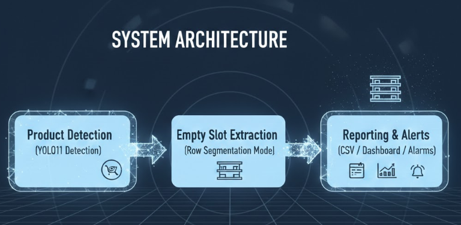
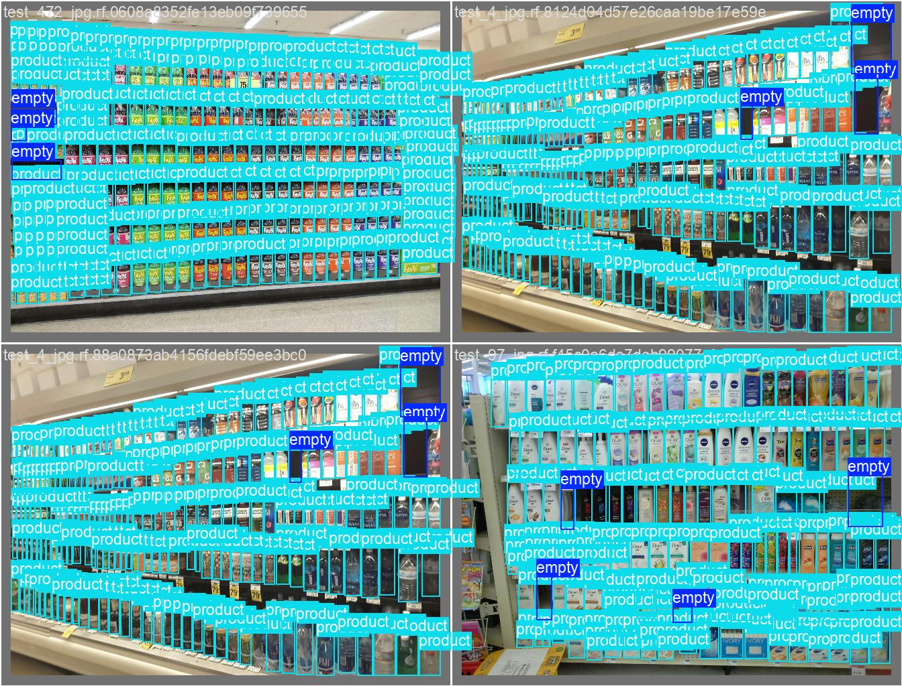
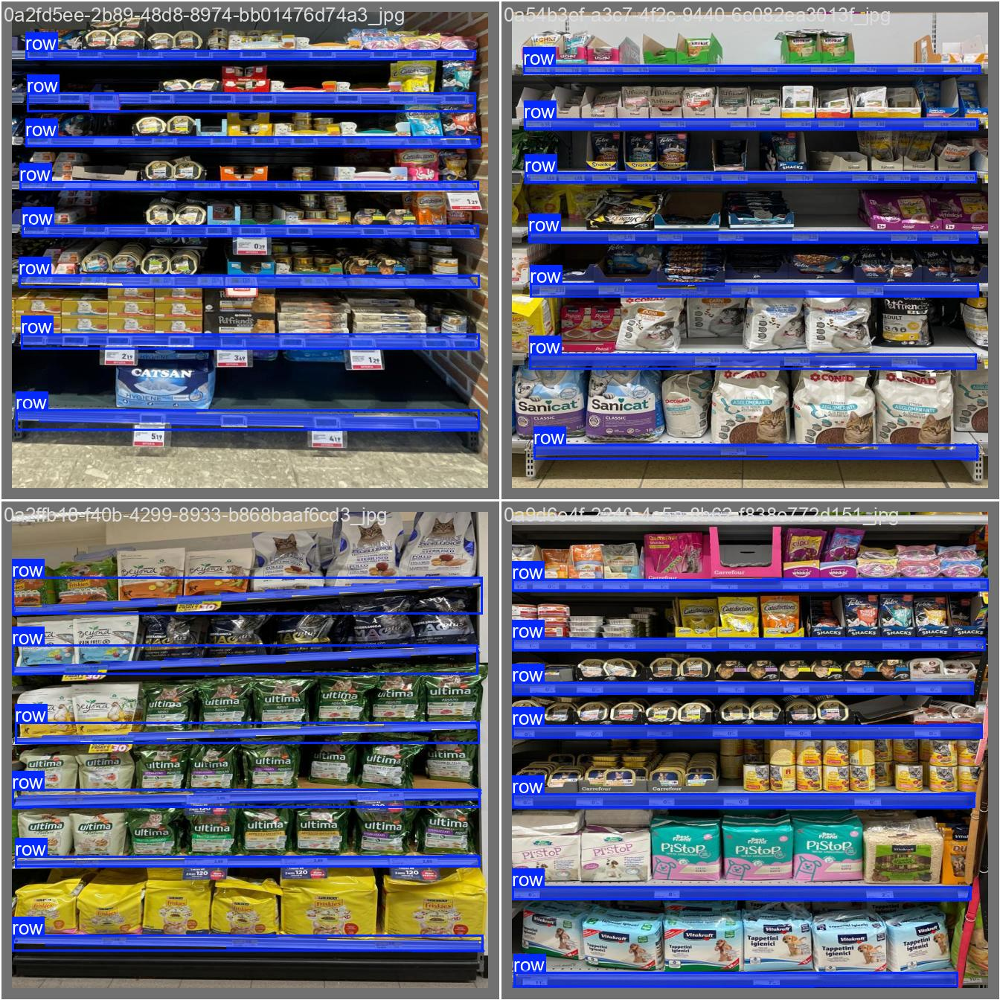

# Empty Shelf Space Detection and Analytics

## 📝 Overview
This project presents a **production-ready retail shelf analytics system** that detects **products and empty shelf spaces** using unified YOLO11 models.

The system is designed for **automated shelf monitoring in supermarkets and retail stores**, enabling detection of:
- Product presence
- Empty shelf spaces
- Potential out-of-stock zones

This solution is relevant for **large retail chains & smart stores**, where manual shelf auditing is inefficient and error-prone.

---

## ⚠️ Problem Statement
Retail stores frequently suffer from:
- Out-of-stock products
- Poor shelf utilization
- Delayed restocking decisions

Manual shelf inspection does not scale across large supermarkets.  
This project addresses this problem using **computer vision-driven shelf analytics**.

---

## ⚙️ Key Features
✔ Product detection on retail shelves  
✔ Empty shelf space detection  
✔ Unified dataset for products + empty shelf regions  
✔ Per-row analytics for actionable insights  
✔ Interval-based inference to save CPU/GPU resources  
✔ CSV-based reporting for business dashboards  
✔ Works with IP cameras, webcams, and video files  
✔ Edge-device friendly (Jetson Nano, Raspberry Pi)

---

## 🗂️ Dataset Strategy (Key Innovation)
This project uses a **hybrid dataset construction approach** to enable robust empty shelf detection.

### 1️⃣ Product Detection Dataset
- SKU-based retail product images
- Trained YOLO11 model to detect **products on shelves**

### 2️⃣ Empty Shelf Dataset
- Public dataset from Roboflow:
  - [Supermarket Empty Shelf Detector](https://universe.roboflow.com/fyp-ormnr/supermarket-empty-shelf-detector)
- Contains only **empty shelf annotations**

### 3️⃣ Weakly-Supervised Relabeling (Core Contribution)
To unify both datasets:
1. Pretrained product YOLO11 model is run on empty shelf images  
2. Detected products are auto-saved as YOLO labels  
3. Final class mapping:
   - `class_id = 0` → Empty shelf space  
   - `class_id = 1` → Product  

Result: a **single dataset with both classes** without manual relabeling.

---

## 🏷️ Class Mapping
| Class ID | Label             |
|----------|------------------|
| 0        | Empty Shelf Space |
| 1        | Product           |

---

## 🧩 System Architecture



The system processes video streams through three stages:

1. **Product and Empty Space Detection (YOLO11)**  
   Detects all products and the empty space on the shelf.

2. **Row Extraction (YOLO11 Seg)**  
   A YOLO segmentation model trained on shelf row annotations extracts **row boundaries**.

This enables accurate **row-level shelf analytics**.

---

## ⏱️ Interval-Based Inference (Resource Efficient)

Instead of processing every frame, the system:
- Reads camera continuously
- Runs inference **once every N seconds**

Benefits:
✔ Saves GPU/CPU resources  
✔ Reduces power and thermal load  
✔ Ideal for 24/7 edge deployments  
✔ Works on low-bandwidth camera feeds  

---

## 📊 Analytics Output (CSV → Dashboard Ready)

Each inference logs structured analytics into CSV, containing:

| Timestamp           | Row | Empty Slots | Empty % |
| ------------------- | --- | ----------- | ------- |
| 2026-01-20 13:50:45 | 1   | 3           | 22.5%   |
| 2026-01-20 13:50:45 | 2   | 1           | 22.5%   |
| 2026-01-20 13:50:45 | 3   | 0           | 22.5%    |


The CSV output can be used for:

✔ Retail dashboards (Tableau / PowerBI / Superset)  
✔ Automated alerts & notifications  
✔ Inventory & ERP system integration  

---

## 📦 Requirements
```bash
ultralytics
opencv-python
numpy
pandas
```

---

## 🏋️‍♂️ Training and Inference

Paste the below CLI to train
- for detection model

```bash
yolo detect train data=data.yaml model=yolo11n.pt epochs=100 imgsz=640
```

- for segmentation model

```bash
yolo segment train data=row_data.yaml model=yolo11n-seg.pt epochs=80 imgsz=640
```
**Detection and Segmentation Results**

| (a) Detection | (b) Segmentation |
|--------------|------------------|
|  |  |

For more hyperparameters see the [Ultralytics documentation](https://docs.ultralytics.com/quickstart/)

- **for inference**

🎥 Works with multiple video sources:

✔ **IP Cameras**  
✔ **USB/Webcam**  
✔ **Video Files (.mp4, .avi)**  
✔ **Network Streams**  

```bash
python3 main.py --interval 30 --source "http://192.168.0.100:8080/video"
```
**Real Time Inferenced**
 
<h2>Detection Results and Shelf Statistics</h2>

<table>
  <tr>
    <th>(a) Detection Result</th>
    <th>(b) Shelf Status Summary</th>
  </tr>
  <tr>
    <td>
      
    </td>
    <td>
      <b>Timestamp-wise Shelf Analysis</b>
      <table>
        <tr>
          <th>Timestamp</th>
          <th>Row</th>
          <th>Empty Slots</th>
          <th>Whole Empty Shelf %</th>
        </tr>
        <tr><td>2026-01-20 13:50:45</td><td>1</td><td>0</td><td>4.76%</td></tr>
        <tr><td>2026-01-20 13:50:45</td><td>2</td><td>1</td><td>4.75%</td></tr>
        <tr><td>2026-01-20 13:50:45</td><td>3</td><td>1</td><td>4.76%</td></tr>
        <tr><td>2026-01-20 13:50:45</td><td>4</td><td>2</td><td>4.76%</td></tr>
        <tr><td>2026-01-20 13:50:45</td><td>5</td><td>0</td><td>4.75%</td></tr>
        <tr><td>2026-01-20 13:50:45</td><td>6</td><td>0</td><td>4.76%</td></tr>
        <tr><td>2026-01-20 13:50:45</td><td>7</td><td>0</td><td>4.76%</td></tr>
      </table>
    </td>
  </tr>
</table>

---

## 📐 Empty Space Area Calculation

To quantify how much shelf space is empty vs occupied, the system uses an **area-based metric** instead of pure object count.

For each inference frame:

- All **empty shelf regions** (`class_id = 0`) are detected
- All **product regions** (`class_id = 1`) are detected

The area of each bounding box is computed and accumulated.

### 🧮 <ins>Formula</ins>
Empty Area % = (Total Empty Area / (Total Empty Area + Total Product Area)) * 100

Where:

- **Total Empty Area** = sum of pixel areas of all `class 0` detections
- **Total Product Area** = sum of pixel areas of all `class 1` detections


### 📝 <ins>Example Interpretation</ins>

If in a given frame:

- Total empty area = `120000 pixels`
- Total product area = `480000 pixels`

Then:

Empty Area % = (120000 / (120000 + 480000)) * 100
= (120000 / 600000) * 100
= 20%

Meaning **20% of the detected shelf area is empty**.


### 🎯 <ins>Why Area-Based Metric?</ins>

Area-based measurement is preferred because:

✔ Items vary in size (e.g., small gum packs vs large cereal boxes)  
✔ Shelf utilization is proportional to space, not just count  
✔ More realistic for retail inventory analytics  
✔ Works even when slot sizes are inconsistent  


---

## 🚀 Deployment Workflow

Typical deployment flow:

- Mount camera facing shelf
- Start monitoring script with interval
- System logs per-row empty metrics
- CSV consumed by dashboards / APIs
- Alerts trigger when shelf empties

Optimized for edge devices & 24/7 store monitoring.

---

## 🛒 Applications
- Automated shelf monitoring
- Out-of-stock detection
- Shelf utilization analysis
- Retail analytics dashboards
- Smart store deployments

---

## 🌍 Beyond Retail — Other Use Cases

This method can also be applied to:

- Pharmacy shelves
- Warehouse bins
- Tool inventory racks
- Vending machines
- Library shelves

Where stock presence & empty space matter.

---

## 🔮 Future Enhancements

Planned improvements:

- Live dashboard UI (Flask/React)
- REST/MQTT alerting system
- Specific Product Alert
- Multi-camera store support
- Cloud & POS system integration
- Jetson / edge-accelerated builds

---
